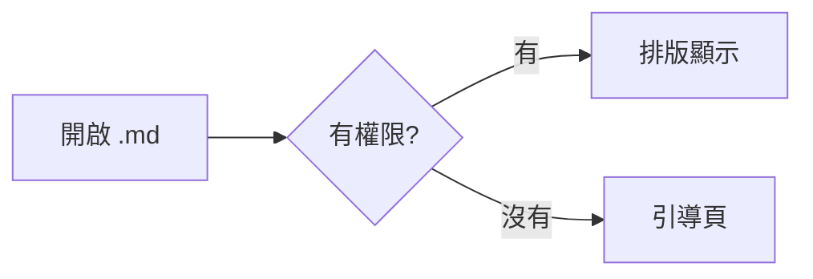
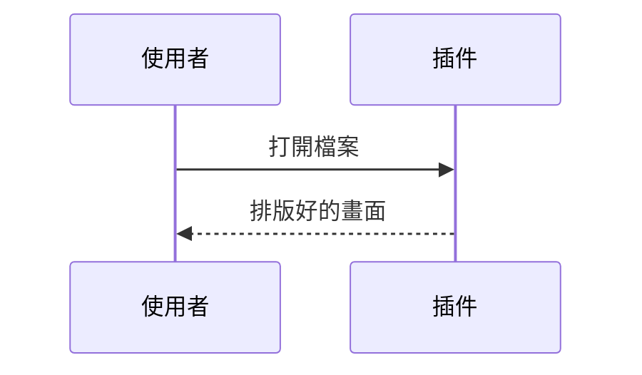

# 流程圖測試

## 流程圖

```mermaid
flowchart LR
  A[開啟 .md] --> B{有權限?}
  B -->|有| C[排版顯示]
  B -->|沒有| D[引導頁]
```

## 循序圖

```mermaid
sequenceDiagram
  使用者->>插件: 打開檔案
  插件-->>使用者: 排版好的畫面
```

## 語法錯誤(應顯示錯誤說明,不會整頁壞掉)
```mermaid
flowchart LR
  A --> 
  這不是正確的語法 {{{
```
